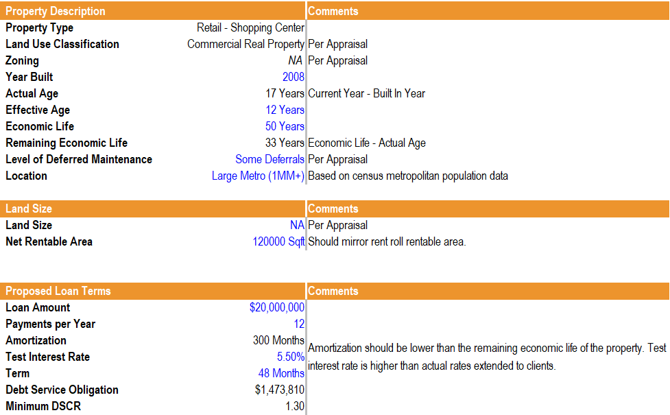
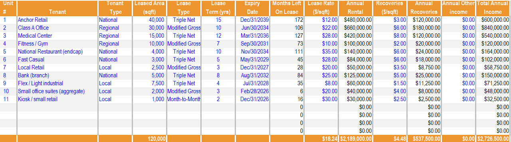
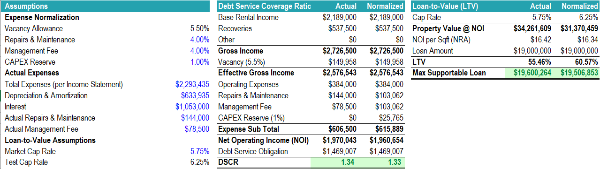
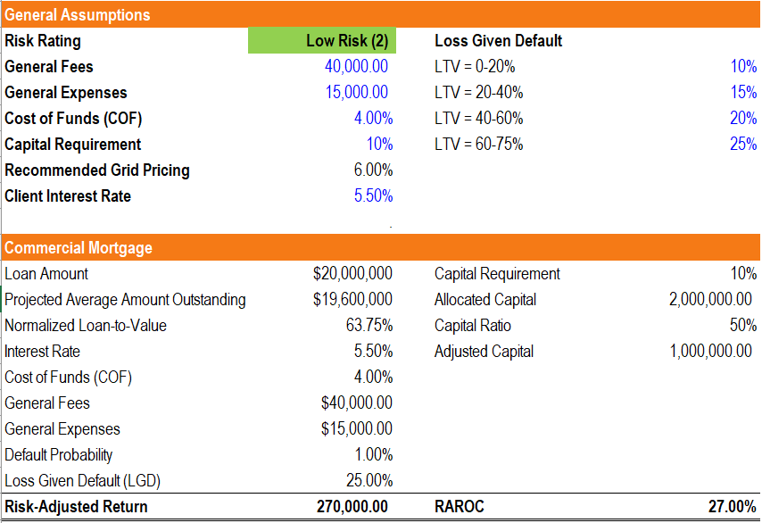

# Commercial Mortgage Case Study – Orlando Commerce Center

## 📌 Project Overview

This project is a commercial real estate mortgage analysis for the Orlando Commerce Center, a fictional retail shopping center located near the I-4 corridor in Orlando, FL.

The study models property performance, loan pricing, and credit risk evaluation from the perspective of a commercial bank lender. It includes:

  - Tenant rent roll and recoveries.

  - Income statement and operating expenses.

  - Loan terms, risk rating, and pricing structure.

  - RAROC (Risk-Adjusted Return on Capital) analysis.

The purpose is to demonstrate financial modeling, real estate credit risk analysis, and bank underwriting skills.

## 📊 Key Features

- Rent Roll: Tenant-level data including lease terms, rental income, recoveries, and occupancy.

- Income Analysis: Net Operating Income (NOI), management fees, depreciation & amortization, repairs & maintenance.

- Loan Pricing: Interest rate, cost of funds, capital requirements, loss-given-default (LGD).

- Risk Rating: Based on LTV, DSCR, and property characteristics.

- RAROC Calculation: To assess if the loan meets bank profitability thresholds.

## 📌 General Conclusion

The commercial mortgage case reflects a well-structured, low-risk financing package for a stabilized shopping retail property. With a loan amount of $20 million, a loan-to-value ratio of 63.75%, and a Low Risk (2) rating, the transaction shows strong credit fundamentals.

The client interest rate of 5.50% against a cost of funds of 4.00% yields a 1.50% spread, which is both market-aligned and sustainable for long-term lending. The resulting Risk-Adjusted Return on Capital (RAROC) of 27.0% is comfortably above standard hurdle rates (15–20%), ensuring solid profitability for the lender without overburdening the borrower.

## 📊 Key Metrics Table

| Metric                       | Value        | Comment                                   |
| ---------------------------- | ------------ | ----------------------------------------- |
| **Loan Amount**              | \$20,000,000 | Strong balance sheet exposure             |
| **Projected Outstanding**    | \$19,600,000 | Nearly fully drawn                        |
| **Normalized LTV**           | 63.75%       | Conservative leverage for retail          |
| **Interest Rate (Client)**   | 5.50%        | Market-aligned for stabilized property    |
| **Cost of Funds (COF)**      | 4.00%        | Bank funding assumption                   |
| **Spread over COF**          | 1.50%        | Competitive and profitable                |
| **Risk Rating**              | 2 (Low Risk) | Reflects strong tenant base and cash flow |
| **Probability of Default**   | 1.0%         | Low credit risk                           |
| **Loss Given Default (LGD)** | 25%          | Standard recovery assumption              |
| **RAROC**                    | 27.0%        | Well above hurdle rate                    |
| **Risk-Adjusted Return**     | \$270,000    | Solid profitability                       |

## 🛠️ File Structure

Commercial Mortgage Model (Orlando Commerce Center).xlsx → Final Excel model with all calculations.

- CFI Cover Page – Project summary.

- Rent Roll – Tenant data and recoveries.

- Analysis – Property income statement and expense breakdown.

- Risk Rating – Loan underwriting criteria.

- Pricing – Loan pricing sheet with RAROC.

- Admin – Supporting assumptions.

## 📎 References

* Confessions of a Real Estate Entrepreneur - Book by James A. Randel
* Commercial Real Estate Finance Specialist Course | CFI

---

✅ This case study was developed as part of a commercial real estate finance and risk management project, showcasing expertise in financial services, credit analysis, and real estate modeling.

---
