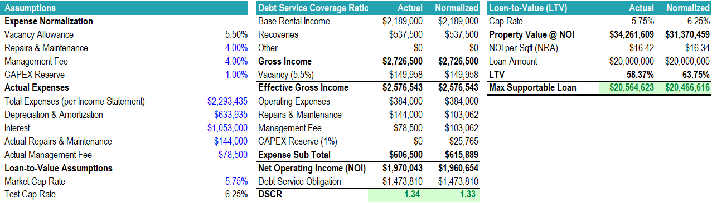

# Commercial Mortgage Case Study – Orlando Commerce Center

## 📌 Project Overview

This project is a commercial real estate mortgage analysis for the Orlando Commerce Center, a fictional retail shopping center located near the I-4 corridor in Orlando, FL.

The study models property performance, loan pricing, and credit risk evaluation from the perspective of a commercial bank lender. It includes:

  - Tenant rent roll and recoveries.

  - Income statement and operating expenses.

  - Loan terms, risk rating, and pricing structure.

  - RAROC (Risk-Adjusted Return on Capital) analysis.

The purpose is to demonstrate financial modeling, real estate credit risk analysis, and bank underwriting skills.

## 📊 Key Features

- Rent Roll: Tenant-level data including lease terms, rental income, recoveries, and occupancy.

- Income Analysis: Net Operating Income (NOI), management fees, depreciation & amortization, repairs & maintenance.

- Loan Pricing: Interest rate, cost of funds, capital requirements, loss-given-default (LGD).

- Risk Rating: Based on LTV, DSCR, and property characteristics.

- RAROC Calculation: To assess if the loan meets bank profitability thresholds.

## 🛠️ File Structure

Commercial Mortgage Model (Orlando Commerce Center).xlsx → Final Excel model with all calculations.

- CFI Cover Page – Project summary.

- Rent Roll – Tenant data and recoveries.

- Analysis – Property income statement and expense breakdown.

- Risk Rating – Loan underwriting criteria.

- Pricing – Loan pricing sheet with RAROC.

- Admin – Supporting assumptions.

## 📎 References

* Confessions of a Real Estate Entrepreneur - Book by James A. Randel
* Commercial Real Estate Finance Specialist Course | CFI

---

✅ This case study was developed as part of a commercial real estate finance and risk management project, showcasing expertise in financial services, credit analysis, and real estate modeling.

---
